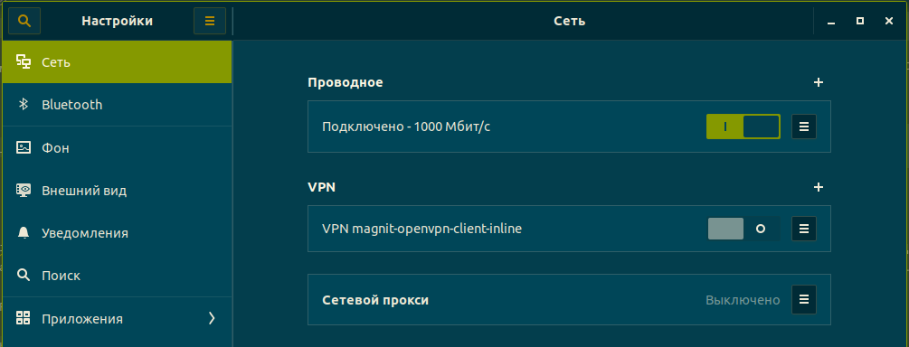
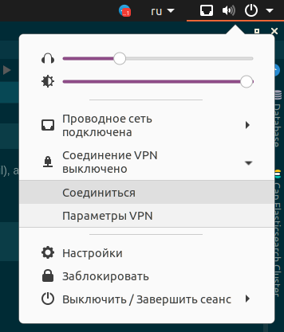
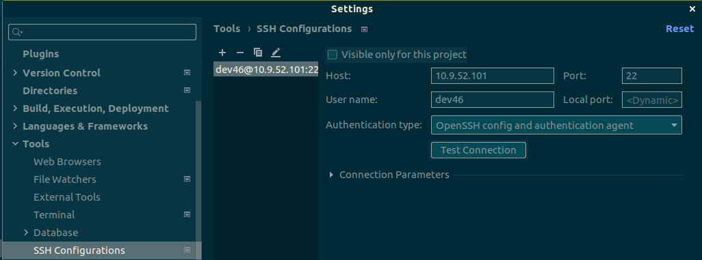
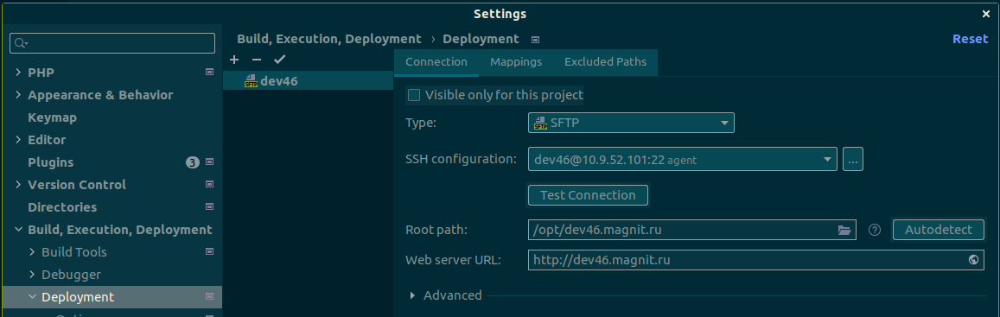
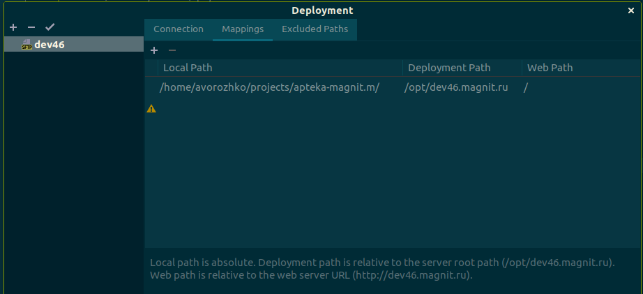
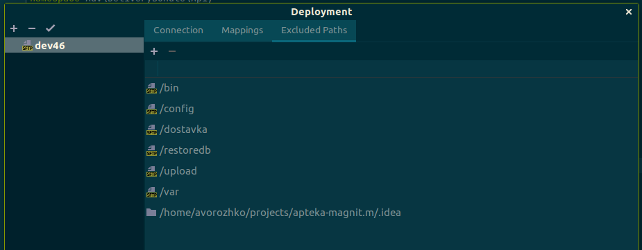
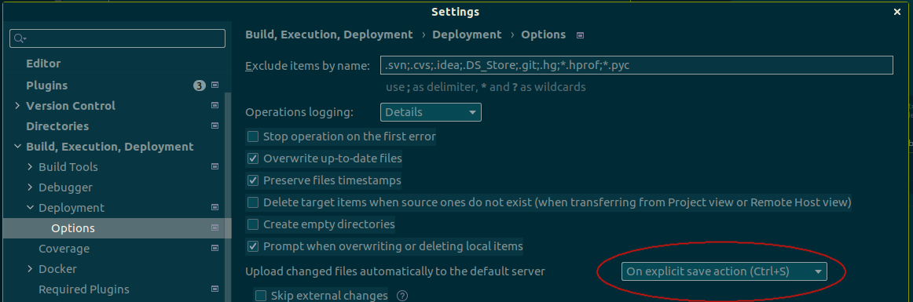

## Инструкция по подключению к dev-стендам Магнита

1. Сгенерировать ssh-ключ командой:

```bash
ssh-keygen -b 4096
```
Или ключ посильнее:

```bash
ssh-keygen -t ed25519 -a 100
```
2. Отправить менеджеру свой адрес корпоративной почты (email), а так же публичную часть ключа.
   
Получить её в консоли можно так:
```bash
cat ~/.ssh/id_rsa.pub
```

3. Получить у менеджера данные для входа:
- VPN конфиг
- devХХХ.magnit.ru, ХХХ - это и есть номер дев-стенда
- IP адрес, например, на текущий момент это 10.9.52.101

4. Включить VPN

Например, в ubuntu openVPN встроен, сконфигурировать можно в настройках сети:



Просто указав файл конфигурации. Запустить можно в правом верхнем углу рабочего стола:



5. Заходим в php-storm по пути:
   
`File->Settings->Tools->SSH Configurations`

Добавляем новую конфигурацию (кнопкой "+"):



! Здесь и далее 46 укажите номер вашего дев-стенда.

6. Заходим в php-storm по пути:

`File->Settings->Build, Execution, Deployment->Deployment`

И создаем новое SFTP соединение (кнопкой "+"):



7. Теперь мы можем соединиться с dev-стендом по ssh:

Через `Tools->Start ssh session...`

Или через терминал:

```bash
ssh -l dev46 10.9.52.101
```
А так же по SFTP через `Tools->Deployment->Browse Remote Host`.

8. Теперь надо настроить маппинги и исключения.
Маппинги:
   
Исключения (папки, которые не надо синхронизировать):
   
(Папка .idea - локальное исключение)
   ! Локальный путь указан для примера, вы можете выставить свой, удобный для вас.
   
9. Теперь надо выкачать файлы с дев-стенда себе локально, если это делать через синхронизацию php-storm, то будет очень долго.

Поэтому будем запаковывать нужные папки в архив, скачивать и распаковывать.

Но сначала почистим кеш, из-под папки `/opt/devXXX.magnit.ru/backend` запускаем

```bash
php bin/console b:c:c
rm -rf var/cache/*
```

Кроме того, желательно в папках `backend`, `bitrix` и `front` переключиться на ветку `master` и спулить последние изменения.

В подкаталоге bitrix git скорее всего не настроен. Делаем
```bash
git init
git remote add origin git@git.m.mcs.im:apteka/bitrix.git
git fetch
git checkout master --force
```

В backend и front чуть попроще:
```bash
git branch --set-upstream-to=origin/master master
git pull
```

Теперь вернемся в `/opt/devXXX.magnit.ru` и запакуем нужные папки в архив:

```bash
tar -zcvf srv.tar.gz backend bitrix front
```

Теперь нужно скачать файл `srv.tar.gz` и распаковать папки `backend`, `bitrix` и `front` в директорию, которую мы указали в маппингах.

10. Еще небольшая настройка.

Надо перейти в

`File->Settings->Build, Execution, Deployment->Deployment->Options`

И выставить вот такую настройку:



Это позволит загружать на дев-стенд локальные изменения, при нажатии `ctrl + S`.

11. Ваш дев-стенд будет доступен по адресу
    
`http://devXXX.magnit.ru`

Админка:

`http://devXXX.magnit.ru/bitrix`

12. Так же лучше сразу провести:

Накат актуальной БД:

Накатка базы - процесс довольно долгий, занимает 1-2 часа, так как она весит не меньше 29 ГБ. Поэтому работать будем через TMUX. Если впн отвалится, то в обычный ssh процесс восстановить будет невозможно и придется его запускать заново, а через TMUX можно будет восстановить процесс командой: tmux a

Что нужно сделать:

Открыть TMUX командой
```bash
tmux
```

в терминале по ssh, проверить командой

```bash
tmux ls
```
что сессия одна, если вывело больше одной сессии, то командой

```bash
tmux kill-server
```

прибить сессии и запустить tmux снова.

Далее собственно накат актуальной БД:

```bash
sudo /opt/restore/restore_dev.sh devXXX
```
(Необходимо будет подтвердить действие с перезаписью базы и ответить в консоли: y/N)

Реиндекс эластики:
```bash
bin/console elastic:index:mapping --group=catalog
bin/console elastic:catalog:update-products
bin/console elastic:catalog:update-prices-pharma --all
bin/console elastic:catalog:update-prices-goods-old
```
Последняя нужна если интересны ещё и продуктовые цены, а не только аптечные

Перезапуск фронта:
```bash
sudo /bin/systemctl restart frontend-devXXX.magnit.ru.service
```

13. Дополнительная информация

Логи отправляемых смсок
```
/opt/devXXX.magnit.ru/var/log/sms/*
```

Сброс админского пароля:
```bash
mysql devXXX -e 'UPDATE b_user SET PASSWORD="M-i8A#l8fb3e4a5da3375679aa5f265109dea898" WHERE ID=1'
```

Если возникают какие-то проблемы, обратитесь к
[расширенному руководству](https://eportal.magnit.ru/pages/viewpage.action?pageId=8984005#id-%D0%9D%D0%B0%D1%81%D1%82%D1%80%D0%BE%D0%B9%D0%BA%D0%B0%D0%B8%D1%80%D0%B0%D0%B1%D0%BE%D1%82%D0%B0%D1%81%D1%82%D0%B5%D1%81%D1%82%D0%BE%D0%B2%D0%BE%D0%B9%D1%81%D1%80%D0%B5%D0%B4%D0%BE%D0%B9-%D0%9A%D0%B0%D0%BA%D0%BD%D0%B0%D1%81%D1%82%D1%80%D0%BE%D0%B8%D1%82%D1%8C%D0%BF%D0%BE%D0%BB%D1%8C%D0%B7%D0%BE%D0%B2%D0%B0%D1%82%D0%B5%D0%BB%D1%8F%D1%81%D0%B0%D0%B4%D0%BC%D0%B8%D0%BD%D1%81%D0%BA%D0%B8%D0%BC%D0%B8%D0%BF%D1%80%D0%B0%D0%B2%D0%B0%D0%BC%D0%B8%D0%B4%D0%BB%D1%8F%D0%B4%D0%BE%D1%81%D1%82%D1%83%D0%BF%D0%B0%D0%B2%D0%B0%D0%B4%D0%BC%D0%B8%D0%BD%D0%BA%D1%83%D0%BD%D0%B0devNN)

(используйте выданный доступ к Confluence Магнита)